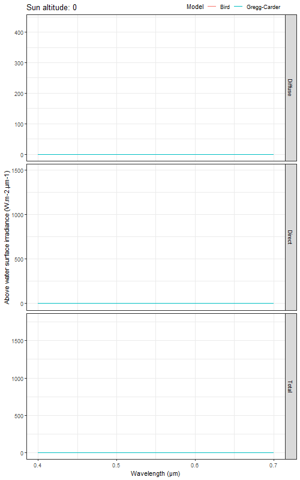

```{r setup, include=FALSE, message = FALSE, warning = FALSE}
knitr::opts_chunk$set(echo = TRUE)

library(ggplot2)
library(oce)
library(insol)
library(stringr)
library(lubridate)
library(Rcpp)
library(patchwork)
library(dplyr)

source("R/bird.R")
source("R/I0_corr_season.R")
source("R/I0_corr_cloud_BIO.R")
source("R/I0_corr_refl_loss.R")
source("R/PAR_resolved.R")
source("R/Gcmod.r")
sourceCpp("underwater_irradiance.cpp")
sourceCpp("surface_irradiance.cpp")
```


This is a summary of the required input and the models used in each step of primary production calculation, with validation for each input and model.  

BIOv2 primary production is calculated using light integrated over wavebands, and then integrated over depth and time using the following resolutions:

- 400-700nm wavebands at 1nm intervals  
- 0-120m depth at 0.5m intervals  
- 0-24 hours at 1hr intervals  


# INPUT


## Variables

### PI parameters

- based on in situ data

### Biomass profile parameters

- based on in situ data
- for non-uniform profiles only


## Satellite data


### Chlorophyll

- using OCx for better comparison/validation, but POLY4 would be more accurate in the NWA
- 8day arithmetic avg of daily data
- gap-filled using DINEOF (compare to VGPM gap-fill method)
    - note: temporal covariance matrix filter was not used (this can possibly improve the results if there are long gaps between days with valid data), see the azcarate paper from 2009?
    - note that vgpm uses equidistant cylindrical input, and this model uses binned data


### PAR

- 8day arithmetic avg of daily data
    - note that vgpm uses equidistant cylindrical input, and this model uses binned data


# MODEL

## STEP 1: SURFACE IRRADIANCE

- surface light model: Emmanuel's png from comparison of bird, GC, COART
- note that we're using 8day input data but this requires a day, so the first day of the week is used

- coart:
https://satcorps.larc.nasa.gov/jin/coart.html

- units, conversions


<b>Bird:</b>  

- Current surface irradiance model used in the primary production calculations at BIO  
- Does not include cloud-correction, or corrections for the time of year or reflection losses at the air-sea interface, but these are calculated afterward for comparison to the GC model  

<b>Gregg-Carder (GC):</b>  

- Modified Bird model for use in the maritimes  
- Higher estimates at shorter wavelengths (compared to Bird)  
- Lower estimates of diffuse irradiance, and direct irradiance at higher solar zenith angles (i.e. when the sun is lower in the sky) in comparison to Bird  

| | |
|-|-|
|||

Figure XXXXXXXX: Differences between Bird and GC models (left) for each waveband from 400-700nm and sun altitudes between 10 and 80 degrees. On the right, the grey ribbon shows the range of sun altitude over the course of a year for several latitudes across the Northwest Atlantic (NWA) region, to see where and when each model might over/underestimate compared to the other.  


## STEP 2: SUBSURFACE IRRADIANCE

### STEP 2A

- chla profile (uniform or non-uniform)
- non-uniform:
    - shifted gaussian used to model profile
    - biomass profile parameters required, taken from in situ data


### STEP 2B

- chla --> absorption and backscattering --> Kd --> attenuated Ed (at each depth, hour, and waveband)
- integrate Ed over wavelength
- check/update:

    - phytoplankton absorption (AC) using the model from Devred et al. 2006: AC = pc1*(1-exp(-rate*chlz)) + pc2*chlz
    - slope of the exponential decrease of yellow substances, using the model from Bricaud et al. 1981 Limnology and Oceanography: Sy = 0.014
    - fraction of ays443 to aph443: fracsys = 0.35
    - backscattering of chla: BC = BC660*(660/lambda)^(-log10(chlz))
        - BC spectral dependence depends on chlz, this means that at chl = 1 there is no spectral dependence. This is weird and has to be checked


## STEP 3: PRIMARY PRODUCTION

- pp model (each hour and depth, then integrated)
- use at least 2 8day "weeks" to compare PP models
- compare biov2 to carla's model and standard vgpm (want it to be within 40% difference)
    - they use equidistant cylindrical input/output, we use binned data - WAIT, I THINK GEORGE USES THE BINNED DATA AT 4KM RESOLUTION, SO PP SHOULD END UP LIKE THAT AS WELL?
    - do they use uniform or non-uniform profiles?


# REFERENCES

[Bird, R. E., & Riordan, C. (1986). Simple Solar Spectral Model for Direct and Diffuse Irradiance on Horizontal and Tilted Planes at the Earth's Surface for Cloudless Atmospheres, Journal of Applied Meteorology and Climatology, 25(1), 87-97. Retrieved Jun 14, 2021, from https://journals.ametsoc.org/view/journals/apme/25/1/1520-0450_1986_025_0087_sssmfd_2_0_co_2.xml](https://journals.ametsoc.org/view/journals/apme/25/1/1520-0450_1986_025_0087_sssmfd_2_0_co_2.xml)  

[Gregg, Watson W., Carder, K. L., (1990), A simple spectral solar irradiance model for cloudless maritime atmospheres, Limnology and Oceanography, 35, doi: 10.4319/lo.1990.35.8.1657.](https://aslopubs.onlinelibrary.wiley.com/doi/abs/10.4319/lo.1990.35.8.1657)  

[Platt, Trevor & Caverhill, Carla & Sathyendranath, Shubha. (1991). Basin-scale estimates of oceanic primary production by remote sensing - The North Atlantic. J. Geophys. Res.. 96. 10.1029/91JC01118.](https://www.researchgate.net/publication/4703165_Basin-scale_estimates_of_oceanic_primary_production_by_remote_sensing_-_The_North_Atlantic)  

[Azcarate, Aïda & Barth, Alexander & Sirjacobs, Damien & Lenartz, Fabian & Beckers, Jean-Marie. (2011). Data Interpolating Empirical Orthogonal Functions (DINEOF): a tool for geophysical data analyses. Mediter. Mar. Sci.. 12. 10.12681/mms.64.](https://www.researchgate.net/publication/277096147_Data_Interpolating_Empirical_Orthogonal_Functions_DINEOF_a_tool_for_geophysical_data_analyses)  

[A, Alvera-Azcárate & Barth, Alexander & Sirjacobs, Damien & J.-M, Beckers. (2009). Enhancing temporal correlations in EOF expansions for the reconstruction of missing data using DINEOF. Ocean Science (OS). 5. 10.5194/osd-6-1547-2009.](https://www.researchgate.net/publication/40892450_Enhancing_temporal_correlations_in_EOF_expansions_for_the_reconstruction_of_missing_data_using_DINEOF)  

[Devred, Emmanuel & Sathyendranath, S & Stuart, V & Maass, H & Ulloa, Osvaldo & Platt, T. (2006). A two-component model of phytoplankton absorption in the open ocean: Theory and applications. Journal of Geophysical Research. 111. 10.1029/2005JC002880.](https://www.researchgate.net/publication/229086123_A_two-component_model_of_phytoplankton_absorption_in_the_open_ocean_Theory_and_applications)  

[VGPM model](http://sites.science.oregonstate.edu/ocean.productivity/vgpm.model.php)  


<!-- ```{r prelim, echo=FALSE, warning=FALSE, message=FALSE} -->
<!-- library(raster) -->
<!-- library(ggplot2) -->
<!-- library(gridExtra) -->
<!-- library(oceancolouR) -->
<!-- library(fst) -->
<!-- library(stringr) -->
<!-- library(scales) -->

<!-- # vgpm files (pp, chl, par) -->
<!-- vgpm_PP_file <- "PP_VGPM/8day_2160x4320/modis/vgpm.2015097.hdf" -->
<!-- vgpm_chl_file <- "PP_VGPM/8day_2160x4320/modis/input_data/chl.2015097.hdf" -->
<!-- vgpm_par_file <- "PP_VGPM/8day_2160x4320/modis/input_data/par.2015097.hdf" -->

<!-- # biov2 file (pp, chl, par all in same file) -->
<!-- bio_file <- "03_PP_output/8day/BIOv2_NWA_8day_2015.fst" -->
<!-- bio_input_gapfill <- "../data_gaps/filled_files/filled_NWA_MODIS_CHL_POLY4_2015_8day_logged_randomCVpts.fst" -->

<!-- # variables to print below -->
<!-- method <- "BIOv2" -->
<!-- year <- 2015 -->
<!-- day_of_year <- 97 -->
<!-- week <- week8(lubridate::as_date(paste(year, day_of_year), format="%Y %j")) -->
<!-- interval <- "8day"            # 8day or monthly -->
<!-- uniform_profile <- TRUE       # chla profile -->
<!-- alphaB = 0.033 * 1000         # mg C (mg chl m-3)-1 s-1 -->
<!-- PBm = 2.5 -->

<!-- lon_bounds <- lon_bounds[["NWA"]] -->
<!-- lat_bounds <- c(lat_bounds[["NWA"]][1], 80) -->
<!-- ``` -->


<!-- # Details -->

<!-- This is a comparison of the BIOv2 primary production model to Standard VGPM from MODIS data, using uniform biomass profiles.   -->

<!-- VGPM source: http://sites.science.oregonstate.edu/ocean.productivity/custom.php   -->

<!-- Color scales: mean +- 2 standard deviations   -->

<!-- % Difference = 100 * (BIOv2 - VGPM) / VGPM   -->

<!-- Possible sources of discrepancies between the two, aside from the model:   -->
<!--   - Different CHL / PAR input   -->
<!--   - Different gap-filling models (BIOv2 uses a simple DINEOF model)   -->


<!--   RESAMPLING OF VGPM TO MATCH RESOLUTION????   -->
<!--   ALSO, CURRENTLY USING NON-FILLED PAR DATA FOR BIOV2   -->


<!-- The day of year used in calculations in the 8day PP images is the first day of that 8day period.   -->
<!-- POLY4 chlorophyll was used instead of OCx.   -->


<!-- # Input data comparison (CHL and PAR) -->

<!-- VGPM CHL: http://orca.science.oregonstate.edu/1080.by.2160.8day.hdf.chl.modis.php   -->
<!-- VGPM PAR: http://orca.science.oregonstate.edu/1080.by.2160.8day.hdf.par.modis.php   -->

<!-- BIOv2 CHL: Pancanadian dataset, averaged to 8day images, filled using DINEOF   -->
<!-- BIOv2 PAR: Pancanadian dataset, averaged to 8day images   -->

<!-- ### CHL -->

<!-- ```{r echo=FALSE, results='asis', fig.align='center', fig.width=10, fig.height=5} -->

<!-- vgpm_rast <- raster(vgpm_chl_file) -->

<!-- bio_df <- read_fst(bio_file) %>% dplyr::filter(floor(time)==year & doy==day_of_year) -->
<!-- bio_rast <- var_to_rast(df=bio_df %>% dplyr::select(bin, chl), ext=c(lon_bounds, lat_bounds)) -->
<!-- bio_unfilled_df <- read_fst(bio_input_gapfill) %>% dplyr::filter(time==(year+(week-1)/46)) -->
<!-- bio_unfilled_rast <- var_to_rast(df=bio_unfilled_df %>% dplyr::select(bin, var), ext=c(lon_bounds, lat_bounds)) -->

<!-- crs(vgpm_rast) <- crs(bio_rast) -->
<!-- extent(vgpm_rast) <- extent(c(xmin=-180,xmax=180,ymin=-90,ymax=90)) -->
<!-- vgpm_rast <- crop(vgpm_rast, extent(bio_rast)) -->
<!-- vgpm_rast[vgpm_rast < 0] <- NA -->
<!-- # https://www.neonscience.org/dc-raster-calculations-r -->
<!-- # For raster math, make sure the rasters have the same CRS, resolution, and defined minimum and maximum values -->
<!-- vgpm_rast <- resample(vgpm_rast, bio_rast) -->

<!-- names(vgpm_rast) <- "VGPM" -->
<!-- names(bio_rast) <- "BIOV2_POLY4_FILLED" -->
<!-- names(bio_unfilled_rast) <- "BIOV2_POLY4" -->

<!-- # Adjust the range of the color scale to +- 2 standard deviations -->
<!-- vgpm_vec <- as.numeric(as.vector(vgpm_rast)) -->
<!-- bio_vec <- as.numeric(as.vector(bio_rast)) -->
<!-- full_vec <- c(vgpm_vec,bio_vec) -->
<!-- full_range <- c(mean(full_vec,na.rm=T) - 2*sd(full_vec,na.rm=T), -->
<!--                 mean(full_vec,na.rm=T) + 2*sd(full_vec,na.rm=T)) -->

<!-- # Make a raster of the difference between them, on a separate color scale -->
<!-- diff_rast <- ((bio_rast - vgpm_rast)/vgpm_rast) * 100 -->
<!-- # diff_rast <- asinh(diff_rast) -->

<!-- diff_vec <- as.numeric(as.vector(diff_rast)) -->
<!-- diff_range <- c(mean(diff_vec,na.rm=T) - 2*sd(diff_vec,na.rm=T), -->
<!--                 mean(diff_vec,na.rm=T) + 2*sd(diff_vec,na.rm=T)) -->
<!-- # Remove outliers for map color scale -->
<!-- diff_rast[diff_rast < diff_range[1] | diff_rast > diff_range[2]] <- NA -->

<!-- grid.arrange(spplot(stack(vgpm_rast, bio_unfilled_rast, bio_rast), zlim=full_range), -->
<!--              # spplot(diff_rast, zlim=diff_range, main="asinh % Difference"), -->
<!--              spplot(diff_rast, zlim=diff_range, main="% Difference"), -->
<!--              ncol=2, widths=c(7,3)) -->

<!-- ``` -->

<!-- ```{r fig.width=10, fig.height=2} -->
<!-- h <- ggplot(data.frame(Difference=diff_vec, stringsAsFactors = FALSE), aes(Difference)) + -->
<!--      geom_density(fill="grey") + -->
<!--      ylab("Density") + -->
<!--      xlab(expression(paste('% difference in input chlorophyll'))) + -->
<!--      scale_x_log10(labels = format_format(nsmall=0, scientific=FALSE, drop0trailing=TRUE)) + -->
<!--      theme_bw() + -->
<!--      theme(legend.position="none") -->
<!-- suppressWarnings(print(h)) -->
<!-- ``` -->


<!-- ### PAR -->

<!-- ```{r echo=FALSE, results='asis', fig.align='center', fig.width=10, fig.height=5} -->

<!-- vgpm_rast <- raster(vgpm_par_file) -->

<!-- # bio_df <- read_fst(bio_file) # already loaded -->
<!-- bio_rast <- var_to_rast(df=bio_df %>% dplyr::select(bin, par), ext=c(lon_bounds, lat_bounds)) -->

<!-- crs(vgpm_rast) <- crs(bio_rast) -->
<!-- extent(vgpm_rast) <- extent(c(xmin=-180,xmax=180,ymin=-90,ymax=90)) -->
<!-- vgpm_rast <- crop(vgpm_rast, extent(bio_rast)) -->
<!-- vgpm_rast[vgpm_rast < 0] <- NA -->
<!-- # https://www.neonscience.org/dc-raster-calculations-r -->
<!-- # For raster math, make sure the rasters have the same CRS, resolution, and defined minimum and maximum values -->
<!-- vgpm_rast <- resample(vgpm_rast, bio_rast) -->

<!-- names(vgpm_rast) <- "VGPM" -->
<!-- names(bio_rast) <- toupper(method) -->

<!-- # Adjust the range of the color scale to +- 2 standard deviations -->
<!-- vgpm_vec <- as.numeric(as.vector(vgpm_rast)) -->
<!-- bio_vec <- as.numeric(as.vector(bio_rast)) -->
<!-- full_vec <- c(vgpm_vec,bio_vec) -->
<!-- full_range <- c(mean(full_vec,na.rm=T) - 2*sd(full_vec,na.rm=T), -->
<!--                 mean(full_vec,na.rm=T) + 2*sd(full_vec,na.rm=T)) -->

<!-- # Make a raster of the difference between them, on a separate color scale -->
<!-- diff_rast <- ((bio_rast - vgpm_rast)/vgpm_rast) * 100 -->
<!-- names(diff_rast) <- "% Difference" -->
<!-- diff_vec <- as.numeric(as.vector(diff_rast)) -->
<!-- diff_range <- c(mean(diff_vec,na.rm=T) - 2*sd(diff_vec,na.rm=T), -->
<!--                 mean(diff_vec,na.rm=T) + 2*sd(diff_vec,na.rm=T)) -->
<!-- # Remove outliers for map color scale -->
<!-- diff_rast[diff_rast < diff_range[1] | diff_rast > diff_range[2]] <- NA -->

<!-- grid.arrange(spplot(stack(vgpm_rast, bio_rast), zlim=full_range), -->
<!--              spplot(diff_rast, zlim=diff_range, main="% Difference"), -->
<!--              ncol=2, widths=c(5,3)) -->

<!-- ``` -->

<!-- ```{r fig.width=10, fig.height=2} -->
<!-- h <- ggplot(data.frame(Difference=diff_vec, stringsAsFactors = FALSE), aes(Difference)) + -->
<!--      geom_density(fill="grey") + -->
<!--      ylab("Density") + -->
<!--      xlab(expression(paste('% difference in input PAR'))) + -->
<!--      scale_x_continuous(labels = format_format(nsmall=0, scientific=FALSE, drop0trailing=TRUE)) + -->
<!--      theme_bw() + -->
<!--      theme(legend.position="none") -->
<!-- suppressWarnings(print(h)) -->
<!-- ``` -->


<!-- # PP comparison -->

<!-- ```{r echo=FALSE, results='asis', fig.align='center', fig.width=10, fig.height=5} -->

<!-- vgpm_rast <- raster(vgpm_PP_file) -->

<!-- # bio_df <- read_fst(bio_file) # already loaded -->
<!-- bio_rast <- var_to_rast(df=bio_df %>% dplyr::select(bin, PP), ext=c(lon_bounds, lat_bounds)) -->

<!-- crs(vgpm_rast) <- crs(bio_rast) -->
<!-- extent(vgpm_rast) <- extent(c(xmin=-180,xmax=180,ymin=-90,ymax=90)) -->
<!-- vgpm_rast <- crop(vgpm_rast, extent(bio_rast)) -->
<!-- vgpm_rast[vgpm_rast < 0] <- NA -->
<!-- # https://www.neonscience.org/dc-raster-calculations-r -->
<!-- # For raster math, make sure the rasters have the same CRS, resolution, and defined minimum and maximum values -->
<!-- vgpm_rast <- resample(vgpm_rast, bio_rast) -->

<!-- names(vgpm_rast) <- "VGPM" -->
<!-- names(bio_rast) <- toupper(method) -->

<!-- # Adjust the range of the color scale to +- 2 standard deviations -->
<!-- vgpm_vec <- as.numeric(as.vector(vgpm_rast)) -->
<!-- bio_vec <- as.numeric(as.vector(bio_rast)) -->
<!-- full_vec <- c(vgpm_vec,bio_vec) -->
<!-- full_range <- c(mean(full_vec,na.rm=T) - 2*sd(full_vec,na.rm=T), -->
<!--                 mean(full_vec,na.rm=T) + 2*sd(full_vec,na.rm=T)) -->

<!-- # Make a raster of the difference between them, on a separate color scale -->
<!-- diff_rast <- ((bio_rast - vgpm_rast)/vgpm_rast) * 100 -->
<!-- names(diff_rast) <- "% Difference" -->
<!-- diff_vec <- as.numeric(as.vector(diff_rast)) -->
<!-- diff_range <- c(mean(diff_vec,na.rm=T) - 2*sd(diff_vec,na.rm=T), -->
<!--                 mean(diff_vec,na.rm=T) + 2*sd(diff_vec,na.rm=T)) -->
<!-- # Remove outliers for map color scale -->
<!-- diff_rast[diff_rast < diff_range[1] | diff_rast > diff_range[2]] <- NA -->

<!-- grid.arrange(spplot(stack(vgpm_rast, bio_rast), zlim=full_range), -->
<!--              spplot(diff_rast, zlim=diff_range, main="% Difference"), -->
<!--              ncol=2, widths=c(5,3)) -->

<!-- ``` -->


<!-- ```{r fig.width=10, fig.height=2} -->
<!-- h <- ggplot(data.frame(Difference=diff_vec, stringsAsFactors = FALSE), aes(Difference)) + -->
<!--      geom_density(fill="grey") + -->
<!--      ylab("Density") + -->
<!--      xlab(expression(paste('% difference in primary production'))) + -->
<!--      scale_x_continuous(labels = format_format(nsmall=0, scientific=FALSE, drop0trailing=TRUE)) + -->
<!--      theme_bw() + -->
<!--      theme(legend.position="none") -->
<!-- suppressWarnings(print(h)) -->
<!-- ``` -->

